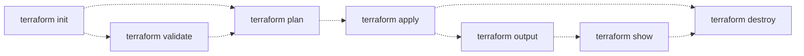

# Prolog 
- Prometheus를 k8s cluster에 설치하는 실습을 진행하고자 설치 환경을 알아보던 중, Azure의 무료 credit이 있어 AKS를 설치해 보았다. 
- 평소 실습해보고자 했던 `Terraform` 을 이용하여 Provisioning 하는 history를 기록에 남기고자 작성한 blog 이다. 
- 실제 작업 후 2개월 이후에 작성하는 내용이라 기억이 가물가물 하다... 

# 1. 개 요
----
* Prometheus - [ kube-prometheus-stack ] 
* Loki - for log
* Tempo, Opentelemetry Agent - for trace
* Exporters - Redis, PostgreSQL

## 1-1. 파일 구조 
```bash
$ tree
.
├── az_terra.sh
└── terraform
    ├── 0_variables.tf
    ├── 1_providers.tf
    ├── 2_ssh.tf
    ├── 3_main.tf
    ├── 7_output.tf
    ├── main.tfplan
    ├── terraform.tfstate
    └── terraform.tfstate.backup
```

## 1-2. 전체 흐름 - `az_terra.sh` 
```bash
export USERNAME=********@hotmail.com
az account list --query "[?user.name=='********@hotmail.com'].{Name:name, ID:id, Default:isDefault}" --output Table

az group  list --query "[?location=='koreacentral']"

[
  {
    "cloudName": "AzureCloud",
    "homeTenantId": "b42795af-74d2-****-*****-****",
    "id": "9e7c5e29-60c3-4a20-8afd-*********",
    "isDefault": true,
    "managedByTenants": [],
    "name": "Microsoft Azure 스폰서쉽 2",
    "state": "Enabled",
    "tenantId": "b42795af-74d2-****-*****-****",
    "user": {
      "name": "********@hotmail.com",
      "type": "user"
    }
  }
]

## 
export MSYS_NO_PATHCONV=1

az account set --subscription "9e7c5e29-60c3-******-****-********"

az ad sp create-for-rbac --name vmss_rbac --role Contributor --scopes /subscriptions/9e7c5e29-60c3-******-****-********

{
  "appId": "a887e74b-****-4ae5-84d6-********",
  "displayName": "vmss_rbac",
  "password": "q5b8Q~D&&&&&&*****jec_k",
  "tenant": "b42795af-74d2-****-*****-****"
}


export ARM_SUBSCRIPTION_ID="9e7c5e29-60c3-******-****-********"
export ARM_TENANT_ID="b42795af-74d2-****-*****-****"
export ARM_CLIENT_ID="a887e74b-****-4ae5-84d6-********"
export ARM_CLIENT_SECRET="q5b8Q~D&&&&&&*****jec_k"


az ad sp create-for-rbac --name <service_principal_name> --role Contributor --scopes /subscriptions/<subscription_id>


provider "azurerm" {
  features {}

  subscription_id   = "9e7c5e29-60c3-******-****-********"
  tenant_id         = "b42795af-74d2-****-*****-****"
  client_id         = "a887e74b-****-4ae5-84d6-********"
  client_secret     = "q5b8Q~D&&&&&&*****jec_k"
}

client_certificate = <sensitive>
client_key = <sensitive>
cluster_ca_certificate = <sensitive>
cluster_password = <sensitive>
cluster_username = <sensitive>
host = <sensitive>
key_data = "ssh-rsa AAAAB3NzaC1yc2EAAAADAQABAAABgQCuQxKT5JhDZD+************/r11DJCx/SlwguHFucV3R+wQSF7/3WwZaqANUS/ArN+zUoAjqmST/UfaJ5JBg4aehoHmzzzhVn/cqA3V31V2rJog5siIYYFFan19VgxsqS3/QH9kxU0/QjQ3PqLOe0hPrbENpnJ8t1BgszokaTPToaJrCMIoCzgY7mBWVnseqgG6qU8vowMM**************tmFKD/tCylxBTecfAsbJBiJt5lcx8eF5dIS**************I7IhAyeHKicexZbt82Lxu6tXwJERYBQ5lkX4Kp************iMuJQ9QEChPCKveKlmU+Tlg3n1P0fNbCo+oWCdRuP6hm4HrU/+Z**********rCCU= generated-by-azure"
kube_config = <sensitive>
kubernetes_cluster_name = "cluster-diverse-bear"
resource_group_name = "rg-premium-koala"
```

## 1-3. Terraform 설정 값 
- `terraform-docs`로 생성함 

```bash
$ brew install terraform-docs
...
$ terraform-docs markdown table \
    --output-file README.md \
    --output-mode inject \
    .

README.md updated successfully
```

### 1-3-1. README.md file 내용 - `terraform-docs` 생성파일
---
> <!-- BEGIN_TF_DOCS -->
> ### Requirements
> 
> | Name | Version |
> |------|---------|
> | <a name="requirement_terraform"></a> [terraform](#requirement\_terraform) | >=1.0 |
> | <a name="requirement_azapi"></a> [azapi](#requirement\_azapi) | ~>1.5 |
> | <a name="requirement_azurerm"></a> [azurerm](#requirement\_azurerm) | ~>3.0 |
> | <a name="requirement_random"></a> [random](#requirement\_random) | ~>3.0 |
> | <a name="requirement_time"></a> [time](#requirement\_time) | 0.9.1 |
> 
> ### Providers
> 
> | Name | Version |
> |------|---------|
> | <a name="provider_azapi"></a> [azapi](#provider\_azapi) | 1.12.1 |
> | <a name="provider_azurerm"></a> [azurerm](#provider\_azurerm) | 3.93.0 |
> | <a name="provider_random"></a> [random](#provider\_random) | 3.6.0 |
> 
> ### Modules
> 
> No modules.
> 
> ### Resources
> 
> | Name | Type |
> |------|------|
> | [azapi_resource.ssh_public_key](https://registry.terraform.io/providers/azure/azapi/latest/docs/resources/> resource) | resource |
> | [azapi_resource_action.ssh_public_key_gen](https://registry.terraform.io/providers/azure/azapi/latest/docs/> resources/resource_action) | resource |
> | [azurerm_kubernetes_cluster.k8s](https://registry.terraform.io/providers/hashicorp/azurerm/latest/docs/> resources/kubernetes_cluster) | resource |
> | [azurerm_resource_group.rg](https://registry.terraform.io/providers/hashicorp/azurerm/latest/docs/> resources/resource_group) | resource |
> | [random_pet.azurerm_kubernetes_cluster_dns_prefix](https://registry.terraform.io/providers/hashicorp/> random/latest/docs/resources/pet) | resource |
> | [random_pet.azurerm_kubernetes_cluster_name](https://registry.terraform.io/providers/hashicorp/random/> latest/docs/resources/pet) | resource |
> | [random_pet.rg_name](https://registry.terraform.io/providers/hashicorp/random/latest/docs/resources/pet) | > resource |
> | [random_pet.ssh_key_name](https://registry.terraform.io/providers/hashicorp/random/latest/docs/resources/> pet) | resource |
> 
> ### Inputs
> 
> | Name | Description | Type | Default | Required |
> |------|-------------|------|---------|:--------:|
> | <a name="input_msi_id"></a> [msi\_id](#input\_msi\_id) | The Managed Service Identity ID. Set this value > if you're running this example using Managed Identity as the authentication method. | `string` | `null` | > no |
> | <a name="input_node_count"></a> [node\_count](#input\_node\_count) | The initial quantity of nodes for the > node pool. | `number` | `2` | no |
> | <a name="input_resource_group_location"></a> [resource\_group\_location]> (#input\_resource\_group\_location) | Location of the resource group. | `string` | `"koreacentral"` | no |
> | <a name="input_resource_group_name_prefix"></a> [resource\_group\_name\_prefix]> (#input\_resource\_group\_name\_prefix) | Prefix of the resource group name that's combined with a random ID > so name is unique in your Azure subscription. | `string` | `"rg"` | no |
> | <a name="input_username"></a> [username](#input\_username) | The admin username for the new cluster. | > `string` | `"azureadmin"` | no |
> 
> ### Outputs
> 
> | Name | Description |
> |------|-------------|
> | <a name="output_client_certificate"></a> [client\_certificate](#output\_client\_certificate) | n/a |
> | <a name="output_client_key"></a> [client\_key](#output\_client\_key) | n/a |
> | <a name="output_cluster_ca_certificate"></a> [cluster\_ca\_certificate]> (#output\_cluster\_ca\_certificate) | n/a |
> | <a name="output_cluster_password"></a> [cluster\_password](#output\_cluster\_password) | n/a |
> | <a name="output_cluster_username"></a> [cluster\_username](#output\_cluster\_username) | n/a |
> | <a name="output_host"></a> [host](#output\_host) | n/a |
> | <a name="output_key_data"></a> [key\_data](#output\_key\_data) | n/a |
> | <a name="output_kube_config"></a> [kube\_config](#output\_kube\_config) | n/a |
> | <a name="output_kubernetes_cluster_name"></a> [kubernetes\_cluster\_name]> (#output\_kubernetes\_cluster\_name) | n/a |
> | <a name="output_resource_group_name"></a> [resource\_group\_name](#output\_resource\_group\_name) | n/a |
>
> <!-- END_TF_DOCS -->
---

### 1-3-2. `0-variables.tf` 파일 내용 중 변경 사항
```hcl
variable "resource_group_location" {
  type        = string
  default     = "koreacentral"  ###### region 설정 ######
  description = "Location of the resource group."
}


variable "node_count" {
  type        = number
  description = "The initial quantity of nodes for the node pool."
  default     = 2  ###### cluster node 갯수 설정 : minimal 설정 ######
}


variable "username" {
  type        = string
  description = "The admin username for the new cluster."
  default     = "azureadmin" ###### username for cluster (default value 그대로 이용) ######
}
```

### 1-3-3. `1_providers.tf` 
```hcl
terraform {
  required_version = ">=1.0"

  required_providers {
    azapi = {
      source  = "azure/azapi"
      version = "~>1.5"
    }
    azurerm = {
      source  = "hashicorp/azurerm"
      version = "~>3.0"
    }
    random = {ㄹ
      source  = "hashicorp/random"
      version = "~>3.0"
    }
    time = {
      source  = "hashicorp/time"
      version = "0.9.1"
    }
  }
}

provider "azurerm" {
  features {}

  subscription_id   = "9e7c5e29-60c3-******-****-********"  ###### 설정에 맞게 변경함 ######
  tenant_id         = "b42795af-74d2-****-*****-****"       ###### 설정에 맞게 변경함 ######
  client_id         = "a887e74b-****-4ae5-84d6-********"    ###### 설정에 맞게 변경함 ######
  client_secret     = "q5b8Q~D&&&&&&*****jec_k"             ###### 설정에 맞게 변경함 ######
}

```

### 1-3-4. `2_ssh.tf` : 변경사항 없음

### 1-3-5. `3_main.tf` 

```hcl
....(생략)....

  default_node_pool {
    name       = "agentpool"          ###### pool 이름 설정 ######
    vm_size    = "Standard_D2_v2"     ###### vm size 설정 ######
    node_count = var.node_count
  }
....(생략)....
```

### 1-3-6. `7_output.tf` : 변경 없음

## 2. Terraform 실생 



```bash
$ terraform init 
$ terraform plan 
$ terraform apply 
```

## 7. [참고 사이트]
- ~~기억이 안남~~

## 8. Epilog
- idempotent IaC 을 통해서 infra provisioning 관리를 해보고자 했는데, 실제 업무 환경에서는 보안적 문제와 반복 업무의 부재 등으로 도입 되지 않았다. side-project로 밖에 경험할 수 없을 것 같다. 
- 예전 Hadoop 설치의 복잡함을 해결하고자 ansible로 IaC 구성한 적이 있는데, 자료를 남기지 않았었고, 이전 회사의 경험이라 자료가 없어 기록으로 남기지 못해 아쉽다.  
<br>

---
