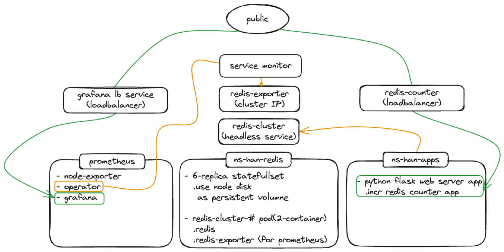
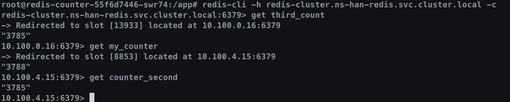

> summary
<!-- truncate -->

# Prolog 
- OSS DB 혹은 cache 솔루션은 성능, 효율성을 강조하는 대신, 정합성을 포함한 안정성에 대해서는 상용 제품들에 비해 기본 기능에서 제공하지 않는 경우가 많다. 
- 고가용성 설정 Oracle RAC 등의 session failover 등의 detail 한 설정을 구현하기는 쉽지 않다. 
- OSS 레벨에서는 Primary에 문제가 생겼을 경우 Primary failover에 중점을 둔 replication 기반은 PSS 혹은 PSA 구조의 고가용성 구현이 지배적인 것 같다. 
- 이러한 구조는 primary 운영에 이슈가 생겼을 경우 vote 하는 절차에서 의미 있는 결과를 도출하기 위하여 `quorum` 기반의 알고리즘 이 영향을 미친 것 같다.   

# 1. Task 개요
----
- key-value store 이자 cache로 많이 활용되는 Redis 는 메모리 기반의 휘발성 저장 솔루션이다. 
- persistency를 위하여 RDBMS와 같이 저장장치에 데이터 동기화를 주기적으로 수행할 수 있으나 이 경우 메모리 상의 데이터 변경이 제한된다. 성능 저하 이슈도 발생한다. 
  - 최근에는 ahead logging 방식으로 sequential 하게 log를 기록하여 오버헤드를 줄이고, 이를 streaming 형태로 Standby 서버에 전송하여 준실시간 동기화를 통한 고가용성을 구현할 수 있다. 
- sharding 과 같은 개념으로 key 값을 분산 처리 하여 부하 분산할 수 있도록 cluster 구성이 가능하다. 
- 이에 대한 구현을 아래와 같이 진행하였다. 
- 관리형 k8s cluster 에서 pod 형태로 redis cluster 구성과 모니터링을 구성하였다. 

1. GKE 구성
2. Redis Cluster 구성 
  - `StatefulSet` 활용 
  - Primary-Secondary 구조 구성 
3. Prometheus 설치 
  - redis-exporter 설정 
4. redis 접근 application 생성 및 HA 접근 설정, key 분산 저장 여부 확인 

## 1-1. 구성도

- redis container failover는 gossip protocol에  의해 감지되어 slave가 마스터로 승격되며, readiness probe에 의해 서비스포트(6379)가 10초 이상 서비스  불가 상태일때 pod 재기동이 일어난다.
- 모니터링은 k8s 관리용으로 k9s를 설치하여 cloud credential 값으로 k8s cluster에 접근할 수 있으며, node-shell plugin을 설치하여 node 접근이 가능함. 



# 2. GKE 구성
- GKE 구성은 `SDK` 설치 이후 `CLI` 를 통해 install 진행 

```bash
## env 
export CLUSTER_NAME="gke-han-cluster"
export ZONE="asia-east1"
export NUM_NODES=2
export MACHINE_TYPE="e2-medium"

gcloud auth login q*****@gmail.com

gcloud auth list

gcloud projects list
# PROJECT_ID: ninth-age-4*****-p0
# NAME: My First Project
# PROJECT_NUMBER: 39*******

export PROJECT_ID="your-project-id"
gcloud config set project $PROJECT_ID

gcloud services enable container.googleapis.com

gcloud container clusters create $CLUSTER_NAME \ 
    --zone $ZONE \
    --num-nodes $NUM_NODES \
    --machine-type $MACHINE_TYPE \
    --enable-ip-alias \
    --network "default" --disk-size=50GB \
    --subnetwork "default"
    --enable-workload-identity

gcloud components install kubectl

gcloud container clusters get-credentials $CLUSTER_NAME --zone $ZONE # k8s cluster 접근을 위한 credential 정보 세팅. kubectl 명령어를 위한 context 설정

# add disk 
gcloud compute disks create --size=10GB --zone=asia-east1-a nfs-disk
```

# 3. k8s 워크로드 구성
## 3-1. 파일 구조
```bash
$ tree v1 -L 1
├── 00.disk.yaml        # persistency 용 storage 설정
├── 01.sts.yaml         # statefulset redis-cluster 설정 
├── 03.grafana_svc.yaml # grafana 외부 노출용 
└── backup
```
# 3-2. storage 설정
```yaml
# 00.disk.yaml 
---
kind: StorageClass
apiVersion: storage.k8s.io/v1
metadata:
  name: redis-storageclass
provisioner: pd.csi.storage.gke.io ## gcp CSP storageclass 적용을 위해서 추가 
parameters:
  type: pd-balanced
  replication-type: regional-pd
volumeBindingMode: WaitForFirstConsumer
allowedTopologies:
- matchLabelExpressions:
  - key: topology.gke.io/zone
    values:
    - asia-east1-b
    - asia-east1-c
---
apiVersion: v1
kind: PersistentVolume
metadata:
  name: redis-pv
spec:
  storageClassName: "redis-storageclass"
  capacity:
    storage: 10Gi
  accessModes:
    - ReadWriteMany ## service 공유를 위해서 shared로 생성
  claimRef:
    namespace: default
    name: redis-pv-claim
  csi:
    driver: pd.csi.storage.gke.io
    volumeHandle: projects/ninth-age-******-p0/zones/asia-east1-a/disks/nfs-disk
    fsType: ext4
---
apiVersion: v1
kind: PersistentVolumeClaim
metadata:
  namespace: default
  name: redis-pv
spec:
  storageClassName: "redis-storageclass"
  volumeName: PV_NAME
  accessModes:
    - ReadWriteMany
  resources:
    requests:
      storage: DISK_SIZE
      
```

## 3-3. redis cluster 설정 manifests
```yaml
---
# configmap : redis pod 생성 시 수행할 명령어 저장용 
# 설정 값 지정 
apiVersion: v1
kind: ConfigMap
metadata:
  name: redis-cluster
data:
  update-node.sh: |
    #!/bin/sh
    REDIS_NODES="/data/nodes.conf"
    sed -i -e "/myself/ s/[0-9]\{1,3\}\.[0-9]\{1,3\}\.[0-9]\{1,3\}\.[0-9]\{1,3\}/${POD_IP}/" ${REDIS_NODES}
    exec "$@"
  redis.conf: |+
    cluster-enabled yes
    cluster-require-full-coverage no
    cluster-node-timeout 15000
    cluster-config-file /data/nodes.conf
    cluster-migration-barrier 1
    appendonly yes
    protected-mode no
---
apiVersion: apps/v1
kind: StatefulSet # IP 할당 등 고정된 state 저장을 위하여 deployment가 아닌 statefulset 으로 생성
metadata:
  name: redis-cluster
spec:
  serviceName: redis-cluster
  replicas: 6 # master 3, slave 3 : IP 대역 3개 영역지정
  selector:
    matchLabels:
      app: redis-cluster
  template:
    metadata:
      labels:
        app: redis-cluster
    spec:
      containers:
      - name: redis
        image: redis:7.4.0-alpine
        ports:
        - containerPort: 6379
          name: client
        - containerPort: 16379
          name: gossip
        command: ["/conf/update-node.sh", "redis-server", "/conf/redis.conf"]
        env:
        - name: POD_IP
          valueFrom:
            fieldRef:
              fieldPath: status.podIP
        volumeMounts:
        - name: conf
          mountPath: /conf
          readOnly: false
        - name: data
          mountPath: /data
          readOnly: false
        livenessProbe:
          tcpSocket:
            port: 6379
          initialDelaySeconds: 30
          periodSeconds: 10
          failureThreshold: 3
        readinessProbe:
          tcpSocket:
            port: 6379
          initialDelaySeconds: 5
          periodSeconds: 10
          failureThreshold: 2
      - name : redis-exporter
        image: oliver006/redis_exporter:latest
        ports:
        - containerPort: 9121
        env:
        - name: REDIS_ADDR
          value: "redis://localhost:6379"
      volumes:
      - name: conf
        configMap:
          name: redis-cluster
          defaultMode: 0755
  volumeClaimTemplates:
  - metadata:
      name: data
    spec:
      accessModes: [ "ReadWriteOnce" ] # 단일 pod의 쓰기 허용
      resources:
        requests:
          storage: 1Gi
---
apiVersion: v1
kind: Service
metadata:
  name: redis-cluster
spec:
  type: ClusterIP # redis 를 cluster 내부에서 사용하기 위해 type : ClusterIP 로 지정
  clusterIP: None # Headless Service로 사용하기 위해 설정 추가
  publishNotReadyAddresses: true
  ports:
  - port: 6379
    targetPort: 6379
    name: client
  - port: 16379
    targetPort: 16379
    name: gossip # master availability 확인을 위한 protocol. cluster 전체 node(pod) 통신 발생. 
  - port: 9121
    targetPort: 9121
    name: http-metrics
  selector:
    app: redis-cluster
---
apiVersion: monitoring.coreos.com/v1
kind: ServiceMonitor
metadata:
  name: redis-exporter
  labels:
    release: monitoring # prometheus-operator
spec:
  selector:
    matchLabels:
      app: redis-cluster
  endpoints:
  - port: http
    interval: 30s
```

## 3-4. grafana용 manifests 파일
- `redis-cluster` 와 직접적인 관련은 없음 
- `observability` tool로 설정한 grafana의 `endpoint` 노출을 위해 서비스 추가 
- GKE에 default로 설치된 prometheus 서비스가 있으나, 무료일 경우 제한적인 기능이며 실습을 위해 manual 하게 서리 진행함
- grafana helm chart 에서 LB type으로 생성도 가능
- prometheus, grafana 설치 과정은 생략

```yaml
apiVersion: v1
kind: Service
metadata:
  name: grafana-lb-service
  namespace: prometheus
spec:
  ports:
  - port: 8080
    targetPort: 3000
    name: http
  type: LoadBalancer # 외부에서 확인을 위해 loadbalancer type으로 설정, GCP에서 L4 LB를 자동으로 생성해 줌
  selector:
    app.kubernetes.io/name: grafana
```

# 4. 설치
- 설치는 특별한 부분 없이 `kubectl apply` 로 진행 
- GCP storage class 활용을 위해 csi driver GKE에 추가 설치 

```bash
# csi driver enable
export CLUSTER_NAME="gke-han-cluster"
export ZONE="asia-east1"
export NUM_NODES=2
export MACHINE_TYPE="e2-medium"

gcloud container clusters update $CLUSTER_NAME \
    --update-addons GcsFuseCsiDriver=ENABLED \
    --zone $ZONE


# cluster 용 namespace 생성
kuberctl create namespace ns-han-redis

# storageclass, PV, PVC 설치 
kubectl apply -f 00.disk.yaml -n ns-han-redis

# statefulset 추가 
kubectl apply -f 01.sts.yaml -n ns-han-redis

```

## 4-1. 결과 확인
- k8s object 확인 (`k9s`)
- `statefulSet`으로 진행 시 pod에 대해 기본적으로 일련 번호가 부여됨 


## 4-2. client 설정
- Flask 기반의 python 프로그램으로 sharding 된 cluster 접근 되는 지 체크. 별도의 `namespace`에 배포하여 실제 환경과 비슷하게 구현
- 디렉터리 구조
```bash
redis_counter
├── Dockerfile
├── app.py
├── redis_counter_deploy.yaml
├── redis_counter_service.yaml
├── requirements.txt
└── runShell.sh
```
### 4-2-1. 주요 파일 
- Dockerfile
```
FROM python:3.9-slim

# 작업 디렉터리 설정
WORKDIR /app
RUN apt-get -y update && apt-get -y install \
     curl redis-tools
# requirements.txt 복사 및 설치
COPY requirements.txt ./
RUN pip install --no-cache-dir -r requirements.txt

# 카운터 코드 복사
COPY app.py ./

# 컨테이너 시작 시 실행할 명령어
CMD ["python3", "-m", "flask", "run", "--host=0.0.0.0"]
```

- application code
  - cluster 접근을 위한 package를 설치하여 `Headless Service` 주소로 접근 하도록 설정 
  - `redis-cli` 에서 `redirection` 되는 효과와 같은 효과 발생
```python
from flask import Flask, jsonify
import time
import threading

# Flask 애플리케이션 생성
app = Flask(__name__)

# Redis 서버에 연결

# headless service 주소 활용
# session failover 를 위한 설정 
from rediscluster import RedisCluster
startup_nodes = [
    {"host": "redis-cluster-0.redis-cluster.ns-han-redis.svc.cluster.local", "port": "6379"},
    {"host": "redis-cluster-1.redis-cluster.ns-han-redis.svc.cluster.local", "port": "6379"},
    {"host": "redis-cluster-2.redis-cluster.ns-han-redis.svc.cluster.local", "port": "6379"}
]

try:
    rc = RedisCluster(startup_nodes=startup_nodes, decode_responses=True)
except Exception as e:
    print(startup_nodes)
    print(f"Could not connect to Redis cluster: {e}")
    exit(1)

# 카운터 키
ind_key = ['my_counter', 'counter_second', 'third_count']
len_ind_key = len(ind_key)
curInt = 0

# 카운터 값을 저장할 변수
counter_values = {key: 0 for key in ind_key}

# 주기적으로 카운터를 증가시키는 함수
def increment_counter():
    global curInt
    global rc
    while True:
        counter_key = ind_key[int(curInt % len_ind_key)]
        # 카운터 증가
        rc.incr(counter_key)
        # 현재 카운터 값 출력
        current_value = rc.get(counter_key).decode('utf-8')
        counter_values[counter_key] = current_value
        print(f"Current counter value: {counter_key}::{current_value}")
        # 10초 대기
        time.sleep(10)
        curInt += 1

@app.route('/counters', methods=['GET'])
def get_counters():
    global curInt
    counter_key = ind_key[int(curInt % len_ind_key)]
    current_value = rc.get(counter_key)
    rc.incr(counter_key)
    counter_values[counter_key] = current_value
    curInt += 1
    return jsonify(counter_values)

if __name__ == '__main__':
    counter_thread = threading.Thread(target=increment_counter)
    counter_thread.daemon = True
    counter_thread.start()
    
    # Flask 서버 실행
    app.run(host='0.0.0.0', port=5000)
```

- redis key 접근 확인(`kubectl exec`)



# 5. `Failover` Test
- master - slave는 한 쌍으로 생성되었으며, 같은 네트워크 대역(netmask:24)을 사용함 
- cluster 는 할당 가능한 key 범위(0~16383) 에 대해 cluster의 master node 수 만큼 분할하여 운영됨
- Failover 감지는 Full Mesh 구조의 `gossip` 프로토콜 사용 
  - master 가 down 됨을 감지하는 timeout은 `cluster-node-timeout` 파라미터를 사용하며, default 15s 이다. 
  - master Down 이후 slave 중에 새로운 master를 선출하는 timeout은 `failover-timeout` 파라미터로 default는 180s(3min.) 이다. 
    - master 선출을 위한 알고리즘은 `Raft', 'quorum` 을 사용한다. cf) Paxos 

## 5-1. **pod termination**
  1. pod 강제 종료 : `10.100.5.22` 종료<br/>
  ~~2. gossip protocol을 통해 failver master 인지~~
  ~~3. vote 과정을 통해 slave를 master로 승격~~
  2. 실제는 replicaSet에 의해 15초 이전에 pod가 자동 start 됨. 또한 PV를 통하여 데이터를 저장하므로, transaction 실패 이외에 데이터 유실도 없음 
      - 일정 시간 소요 후 sequence 값도 동기화 됨 : 복제 구성
      - cluster-node-timeout 을 조정하더라도 비슷한 결과 도출
  3. auto-start 되지 않게 다른 방법 접근 필요
```bash

# pod 상태 확인 
kubectl exec -it redis-cluster-0 -c redis -n ns-han-redis -- redis-cli cluster nodes | sort -k 2

c8cf0a82cb04f770c76989c26b3bd0208e25930c 10.100.1.32:6379@16379 slave a397d4dd9438808081d1d2dd7bc03a132693d372 0 1723110187761 3 connected
1696636af983b767cfd6f707b69abfccb9ea972a 10.100.1.39:6379@16379 myself,master - 0 0 1 connected 0-5460
a397d4dd9438808081d1d2dd7bc03a132693d372 10.100.3.23:6379@16379 master - 0 1723110185000 3 connected 10923-16383
a5ea251be2a702f2b63c3a9fa6a54c489fcf8850 10.100.3.24:6379@16379 slave 500f3055bff8fa1c5204b1a12a12c3641b3249a6 0 1723110186000 2 connected
06833b1e155da458dcf9fc38ee6a29c54d3f8e27 10.100.5.19:6379@16379 slave 1696636af983b767cfd6f707b69abfccb9ea972a 0 1723110186751 1 connected
500f3055bff8fa1c5204b1a12a12c3641b3249a6 10.100.5.22:6379@16379 master - 0 1723110186000 2 connected 5461-10922

# pod termination forcely
kubectl delete pod redis-cluster-0 -n ns-han-redis --grace-period 0 --force

# restarted ... 
kubectl exec -it redis-cluster-0 -c redis -n ns-han-redis -- redis-cli cluster nodes | sort -k 2

c8cf0a82cb04f770c76989c26b3bd0208e25930c 10.100.1.32:6379@16379 slave a397d4dd9438808081d1d2dd7bc03a132693d372 0 1723109796233 3 connected
1696636af983b767cfd6f707b69abfccb9ea972a 10.100.1.39:6379@16379 master - 0 1723109797000 1 connected 0-5460
a397d4dd9438808081d1d2dd7bc03a132693d372 10.100.3.23:6379@16379 master - 0 1723109797242 3 connected 10923-16383
a5ea251be2a702f2b63c3a9fa6a54c489fcf8850 10.100.3.24:6379@16379 slave 500f3055bff8fa1c5204b1a12a12c3641b3249a6 0 1723109799259 2 connected
06833b1e155da458dcf9fc38ee6a29c54d3f8e27 10.100.5.19:6379@16379 slave 1696636af983b767cfd6f707b69abfccb9ea972a 0 1723109798251 1 connected
500f3055bff8fa1c5204b1a12a12c3641b3249a6 10.100.5.20:6379@16379 myself,master - 0 0 2 connected 5461-10922

```


## 5-2. network policy - 특정 pod의 네트워크 in/out을 차단하여 failover test
- manifest 파일 
```yaml
apiVersion: networking.k8s.io/v1
kind: NetworkPolicy
metadata:
  name: deny-specific-pod
  namespace: ns-han-redis
spec:
  podSelector:
    matchLabels:
      app: redis-cluster # StatefulSet의 레이블
      statefulset.kubernetes.io/pod-name: redis-cluster-0 # 특정 Pod 이름
  policyTypes:
  - Ingress
  - Egress
```

# \<추가.. 작성중\>


<!-- # 7. [참고 사이트]

# Epilog
-  -->

---
