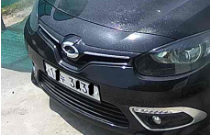
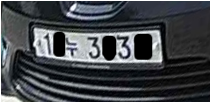
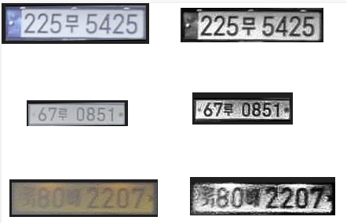
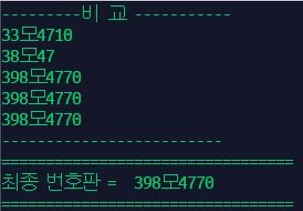
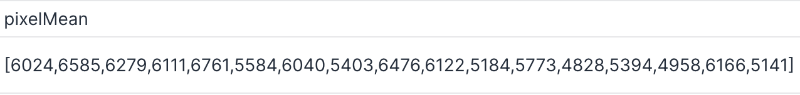
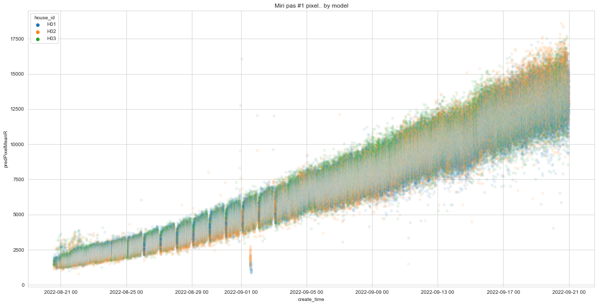
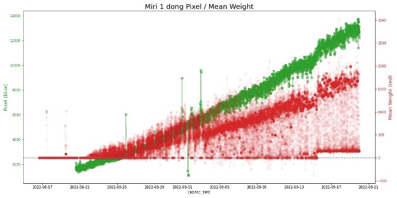
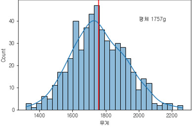
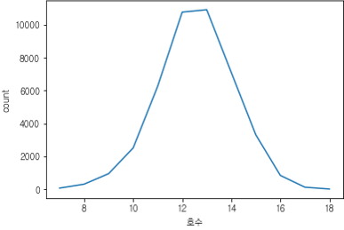
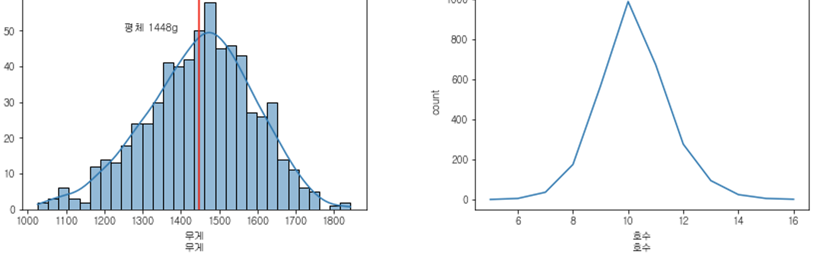

## 가. 개 요

컴퓨터 비전 task 중 개체의 감지는 **Recognition** 에 해당한. 특히 다중 개체 감지의 경우 **object classification** 과 **detection**의 조합으로 이루어 진다. 즉 이미지에서 찾고자 하는 개체의 위치를 알아내는 detection과 detection 된 개체의 종류를 결정하는 classfication의 조합이다.

다중 개체 감지의 detection 은 boundary box를 찾는 형태가 아닌 개별 픽셀이 찾고자 하는 개체에 해당하는 지 판단하는 **segmentation** 기법을 이용하여 개체의 겹쳐진 부분에 대해서도 구별해 낸다.

Image Segmentation은 **이미지에서 특정 클래스에 속하는 각 픽셀을 분류하는 과정**  
을 말한다. 아래 사진에서 보는 것과 같이 Image Segmentation은 이미지에서 동일한 의미를 갖는 것끼리 픽셀 단위로 분류해준다. 자동차, 신호등, 사람, 표지판 등으로 이미지가 분할된 것을 볼 수 있다. Image Segmentation은 **의료 영상, 자율주행차량, 보안, 위성, 항공사진, 가상메이크업, 이미지 검색** 등의 분야에서 많이 응용 되고 있다.

자율주행 Lidar segmentation : [출처 : CVPR2021](https://openaccess.thecvf.com/content/CVPR2021/papers/Aygun_4D_Panoptic_LiDAR_Segmentation_CVPR_2021_paper.pdf)

> **Tesla - [출처: 테슬라 기술 블로그]**  
> Apply cutting-edge research to train deep neural networks on problems ranging from perception to control. Our per-camera networks analyze raw images to perform **semantic segmentation**, **object detection** and **monocular depth estimation**. Our birds-eye-view networks take video from all cameras to output the road layout, static infrastructure and 3D objects directly in the top-down view. Our networks learn from the most complicated and diverse scenarios in the world, iteratively sourced from our fleet of millions of vehicles in real time. A full build of Autopilot neural networks involves 48 networks that take 70,000 GPU hours to train 🔥. Together, they output 1,000 distinct tensors (predictions) at each timestep.

<video width="700" height="587" controls>
  <source src="https://www.tesla.com/sites/default/files/images/careers/autopilot/network.mp4" type="video/mp4" />
</video>

**SOTA 모델 - image segmentation MS COCO dataset**

기본 적인 detection, classification 기법에 외부의 추가적인 정보를 조합하거나 결과 내 관심있는 영역을 특별히 집중하여 세부적인 결과를 추출하는 모델이 domain 별로 발전하고 있으며, 그 중 일반화할 수 있는 기법들로는 Content-based image retrieval, Pose estimation, Optical character recognition (OCR), Facial recognition 등이 있다.

현재 우리 시스템에서 이 기법이 적용된 부분은 **차량 번호판 인식 시스템, 무게 예측** 기능이다. 차량 번호판 인식 시스템은 **차량 detection, 번호판 detection, 번호판에서 번호 추출(OCR)** 의 단계로 진행하여 차량 번호를 추출하는 시스템이다. 무게 예측 기능은 최대한 겹치지 않는 닭을 detection 한 후 segmentation 에서 추출한 pixel의 크기를 활용하여 **무게 예측의 input** 으로 활용한다.

----

## 나. 축사 환경에서의 차량 번호판 인식 시스템

### 1. LPD(License Plate Detection)

**1-1. 차량 출입 감지**

축사의 통상적인 차량 출입은 하루 10대 이하로 많지 않음. 동영상 활용 고성능 computing을 적용하기엔 resource 낭비. 실제 차량 출입 시의 영상이나 연속된 이미지로 처리해도 충분

⇒ 차량 출입 시 연속된 이미지를 하나의 그룹으로 처리

**1-2. 번호판 인식**

번호 인식은 instance segmentation 모델 활용. 번호판을 나타내는 부분의 모든 픽셀 값을 가져옴. 번호판의 모양이 직사각형임을 활용하여 모델이 detection 한 번호판의 왜곡을 직사각형으로 변환함(affine transform).

**왜곡된 번호판 추출 사례**

 
  

LRP 성능 향상을 위하여 변환한 이미지에 이미지 강화 기법 적용 : contrast 향상

  

### 2. LPR(License Plate Recognition)

LPR 입력 소스는 이미지의 gray-scale 이다. 이미지 소스를 제공하는 CCTV의 야간 이미지가 흑백의 이미지로 이를 처리하기 위하여 흑백 이미지를 활용하였음

⇒ 야간 이미지 color 변환 가능한 카메라 도입으로 color input 으로 변경 검토 예정(22.11.21 현재)

**2-1. 국산 번호판 데이터 학습**

연도별 번호판, 차량 용도별 번호판 데이터 모두 학습. 국내 번호판은 외국과 달리 1줄형, 2줄형 번호판이 존자하여 개별 글자 인식이 아닌 CNN 기반의 전체 글자를 한 번에 추론 하는 모델 적용.

**2-2. 번호 결정 로직 개발**

연속된 이미지의 각각 추출한 번호를 기반으로 번호판 구조적 특징과 글자별 확률을 기반으로 최종 번호를 결정함

  
----

## 다. 무게 예측 알고리즘

무게 예측을 위한 모델은 통계적 유의성을 부여하기 위하여 다수의 닭 개체를 감지하는 모델을 활용한다

> 닭 무게는 이미지 상의 크기로 예측 가능하며, 실제 무게와 관계에서 선형성이 있다  
> [참조 논문 : Digital image analysis to estimate the live weight of brolier / 2010](https://www.sciencedirect.com/science/article/pii/S0168169910000384)

CCTV의 설치 위치가 농가별 상이하므로, 농가별로 촬영한 이미지와 detection 결과에서 아래 정보를 바탕으로 활용하여 최종 픽셀 결과를 보정

- 카메라 높이
- 카메라 zoom 정보

### 1. CCTV 이미지 추출

**1-1. Instance segmentation 모델 활용**

닭의 면적을 추출하기 위한 모델으로, 닭 자체를 인식하는 것보다 가림, **경계선 짤림 등을 제외한 온전한 형태의 닭 면적**을 추출하는 것이 더욱 중요한 포인트였다. 학습 데이터는 이러한 배경을 핵심으로 labeling 된 데이터를 활용하였다.

또한 닭의 생육 주기가 병아리~성체 닭에 대한 모든 detection 이 가능하도록 닭의 생육 주기별 데이터를 모두 학습에 활용하였으며, 정확도 97%(AP)

200개 이상의 class(사물 종류)를 대상으로 학습한 instance segmentation 모델을 fine-tuning 하여, 닭 개체만 detecting 하도록 학습하였다. 즉 200개 사물을 구분할 수 있는 능력을 가진 모델에 닭 개체를 찾도록 학습하는 것이다.

  

**1-2. 카메라 높이 보정 공식**

카메라 높이, zoom 정보를 바탕으로 무게 예측 모델 적용을 위한 보정 공식에 적용

[동일 개체에 대한 거리별 이미지 픽셀 관계]

  

**1-3. 육계 성장 기간 내 닭 면적 크기 변화(30일)**

30일(1.5kg 기준 평균 생육기간)을 1파스로 육계의 육성 기간이다. 이 기간 내에 추출한 이미지 면적의 분포는 아래와 같다.

[농장 계사별 닭 면적 정보 - raw data]

[ 농장 계사별 닭 면적 정보 - 대표값 추출 후 ]

### 2. 닭 체중 데이터 [통합 체중계]

닭 체중을 예측하기 위해서 이미지 면적에 대응되는 실제 체중 데이터가 필요하다. 농장에서 실제 무게 측정은 농장 마다 상이하며, 가장 빈번하게 측정하는 출하 예정 일주일 전에도 일일 평균 1회 이상 측정하지 않는다. 또한 측정한 무게도 천 마리 단위로 사육하는 농장에서 100마리 이상 측정하기 힘들다. 사육 이후에 도축장에서 도축 하는 과정에서 개별 무게를 측정하지만, 본 모델에서 활용하기엔 시간적 차이가 크다. 따라서 본 모델에서는 이미지-면적을 수집할 수 있는 통합체중계를 자체 개발 하여 데이터를 수집하였다.

상단의 박스 모듈에는 카메라와 라이다 센서가 내장되어 있다. 하단부 중앙에 위치한 사각형의 모듈에는 로드셀 센서가 내장되어 무게를 측정할 수 있다.

라이다 센서와 로드셀 센서로 닭이 체중계에 올라왔음을 감지한다. 라이다 센서는 체중계와 카메라 사이의 거리를, 로드셀은 무게 변화량을 감지 한다. 닭이 체중계에 올라온 경우 카메라는 이미지를 촬영하며, 로드셀은 20ms 단위로 20회 측정한 데이터를 이미지와 함께 전송하게 된다.

<!-- 
 -->

<!-- <!--  -->

<!--  -->

 -->

**[데이터 예시] 987.9,983.6,986.2,987.2,984.7,986.9,986.3,985.2,986.4,984.5,985.0,985.5,983.8,985.3,983.9,982.6,983.6,976.6,986.0,990.1,935.2,841.3,975.7,997.6,998.6,992.9,1003.8,993.2,991.1,999.2**

  

체중계에는 한 마리 이상의 닭이 올라갈 수 있다. 체중계 위에 올라간 닭 이미지의 처리는 두 가지 방법이 있다.

1. 한 마리 올라간 이미지만 사용
2. 올라간 닭 숫자를 카운트 하는 로직 활용

기본적으로는 1번 방법을 활용한다. 닭의 면적을 정확히 측정하기 위하여 가려진 면적이 없는 1번의 이미지를 주 데이터로 활용한다. 다만, 1마리 닭의 평균 무게를 back 데이터로 활용 하여 무게 변화 추세에 활용할 수 있으므로 2번 데이터 수집도 진행한다.

두 가지 방법에서 실제 무게를 추정하기 위하여 ML 모델을 이용한다. 1번의 경우 sequencial 하게 들어온 데이터에서 이상 데이터를 filtering 하기 위해서, 2번의 경우에는 일 단위 측정한 데이터에서 1마리일때와 2마리 일때를 결정하기 위해서 clustering 기법을 활용하여 데이터를 정제 혹은 가공한다.

### 3. 픽셀-무게

통계학에 따르면 자연,사회 현상에서 충분히 많은 양의 데이터를 수집하면 정규 분포를 이루게 된다. 즉 개별 데이터를 통합하여 전체 집단의 데이터 분포를 추정할 수 있다.

1번 과정을 통하여 이미지 상의 닭 면적을 추출할 수 있다. CCTV 이미지는 최소 5분에 한 장 수집하며, 수집된 이미지에서 최대 40마리의 닭 면적을 추출한다. 일일 기준 축사별 288장, 최대 11520마리의 닭을 촬영한다. 30일 기준 약 34만 건의 닭 이미지가 1개 축사에서 수집된다.

또한 2번 과정을 통해 닭 면적에 비례한 체중 데이터를 뽑을 수 있다. 닭이 체중계에 올라간 경우 감지하여 체중을 측정하며, 평균 1일 100회 정도 이미지가 촬영된다. 하루 100건, 30일 기준 3천건의 데이터가 수집된다. 통합 체중계는 농장별 면적-체중을 보정하기 위한 용도로 농장별 1파스(30일 생육기간 1회)에 대한 데이터만 수집한다.

1번과 2번 데이터를 가지고 관계성을 분석하면 아래와 같다. 면적과 체중은 선형 관계가 있으며, 각 축사별 생육 기간 1파스가 지난 후에는 일반화 할 수 있다. **즉 1파스 데이터를 통하여 이 후 육성하는 닭의 무게를 이미지 만을 통하여 추정할 수 있다.**

[생육 기간 내 ****이미지 면적****, ****체중**** 변화량]

[면적-체중 관계]
  

출하된 육계는 도축장으로 이동하여 위생 검사 등을 거친 후 등급을 산정하게 된다. 건강에 이상이 없는 닭의 등급은 닭의 무게로 산정한다. 도축장에서는 출하된 전체 닭의 무게 데이터를 추출할 수 있다. 모델이 예측한 데이터 분포와 도축장 도계 무게의 분포를 그래프로 비교하면 아래와 같다. 이미지 면적의 분포와 출하 후 도계장에서 측정한 무게의 분포(모양)이 거의 동일하다. **즉. 전체 닭 무게의 분포를 도계 이전 시점에 예측할 수 있다.**

### 4. 모델 업데이트

이미지 면적의 경우 다중 개체를 감지하는 모델의 성능에 크게 영향을 받는다. 모델의 안정적인 성능 보장을 위해서는 최신 데이터에 대한 검증이 지속적으로 필요하다. 또한 이미지 면적 변화에 요인이 될 수 있는 카메라 높이나 zoom 에 대한 적응력도 갖출 수 있도록, 신규 농장의 추가가 있을 경우 성능 평가, 비교를 지속적으로 수행한다.

체중 데이터의 경우 앞서 기술한 바와 같이 신규 농장의 경우 1파스(30일 생육기간)의 데이터를 수집하는 것을 기본으로 한다. 1파스 데이터를 통하여 현재 모델의 정확도를 측정할 수 있으며, 추가 학습을 통하여 무게 예측 모델 성능을 추가적으로 향상 시킬 수 있다.

## 참 고

U-Net segmentation 예제

> `info` 
> **Semantic Segmentation을 활용한 차량 파손 탐지 딥러닝 모델 개발기**
> 쏘카에서 2019년 하반기에 딥러닝 기반의 차량 파손 탐지 모델을 개발했습니다. 이 포스트를 통해 왜 차량 파손 탐지 모델을 만들게 되었는지, 어떤 고민들을 거쳐 요구사항을 설정하였는지, 어떤 기술들이 사용되었는지 등 프로젝트의 전반적인 내용을 소개하는 글입니다. 먼저 사용자가 쏘카 앱을 통해 쏘카를 대여하고 운행하는 과정을 알아보겠습니다. 1) 사용자가 차량을 이용할 쏘카존을 선택합니다.  
> [https://tech.socarcorp.kr/data/2020/02/13/car-damage-segmentation-model.html](https://tech.socarcorp.kr/data/2020/02/13/car-damage-segmentation-model.html)