개체 추적 기술은 개체 감지 기술의 응용버전이다. **개별 감지 결과를 sequential 하게 연결하여 object의 상태 변화를 데이터화 하는 방법**이다. 특히 연속된 이미지(이미지를 frame으로 삼는 영상)에서 개체의 위치 정보를 위치의 변동이 없는 배경과 비교한 물리데이터를 추출하여 motion 분석으로 활용하는 기술이 개체 추적이다. 구체적인 task 로는 egomotion, optical flow, tracking 등이 있다. 실제 task의 구분은 모호할 수 있으며, 목적에 따라 여러 기법이 합성된 형태로 적용되기도 한다.

우리 회사에서 motion tracking을 적용하거나 적용 예정인 기능은 양돈 분만 감지, 활동성 감지 등이 있다. 양돈 분만 감지는 모돈이 새끼돼지를 분만하는 시점을 감지하는데 활용하고 있다. 활동성 감지는 동영상을 데이터 소스로 이동 거리 기반의 분석이나, 개별 개체의 추적이 현실적으로 어려운 경우 밀도 기반 분석을 통해 가능할 것으로 생각된다. 양돈의 경우 CCTV를 통해 tracking 하는 개체수가 많지 않으므로, 비육사 내 돼지의 움직임을 감지하여 이동성 기반으로 활동성 확인이 가능할 것이다. 이동성이 현저히 떨어질 경우 정상이 아님을 감지하는 이상 감지 기법으로 활용한다. 양계의 경우 모든 개체의 추적이 쉽지 않으므로 밀도 기반의 분석이 현실적이다.

- **ISSUE**
    
    데이터 수집 장비인 CCTV 카메라의 위치 독립성 필요(분만사 설비와 이격 등-흔들림 방지)
    
    실시간 동영상 처리를 위한 infra 산정 및 테스트 필요 : computing power , network bandwidth
    
    카메라 화질 (low priority)
    
    - 지속적인 tracking을 위해서는 동영상 처리 시간이 현실적이어야 함.(현 gateway 기준 실 분석 시간은 실제 동영상 시간의 3~5배 소요)
    - 위와 같은 이유로 출산 후 tracking도 현재는 한계점이 있음
    - 카메라의 설치 위치가 분만사의 기구들과 독립적일 필요가 있음. 모돈의 움직임에 따라 카메라의 초점이 흔들리는 현상 발생(양돈 분만 관련)
    - 현재 2MP 카메라의 동영상 촬영 시, 2개 이상의 카메라에서 동시 생성하는 동영상에 화면 깨짐 현상이 발생
    - 2MP 의 최대 해상도 동영상의 화질도 육안으로 볼 때, 경계선이 모호함. 특히, 분만 시 모돈의 움직임이 클 때 더욱 심함(양돈 분만 관련)

## 가. 양돈 분만 감지

### 1. motion tracking 모델

tracking을 위한 모델은 **instance segmentation이 가능한 모델 활용**. 개체가 이루는 contour에 대한 정보로 중심 위치를 산정하기 위함. 또한 predict 시 정확한 영역을 detecting 하는 지 체크할 수 있음.

동영상에서 detection도 이미지와 동일한 labeling 방법을 사용하였으며, top-view 의 데이터를 학습함

### 2. 분만 판정 모델

분만 판정은 **piglet의 형태 정보와 위치 정보를 기반**으로 일정 시간 내 기준치 이상 관찰되어야 분만으로 판단함. 예를 들어 2초(48 frame) 내 유효 카운트 이상의 frame에서 piglet이 관찰되고, frame 간 그 중심 좌표가 사전 학습한 piglet의 활동 범위내에 위치하고 있어야 한다.

<iframe width="560" height="315"
    src="https://www.youtube.com/embed/LuA3lZ5gvYM" 
    frameborder="0" 
    allow="accelerometer; autoplay; encrypted-media; gyroscope; picture-in-picture" 
    allowfullscreen>
</iframe>

## 나. 활동성 감지

활동성은 건강한 개체는 활발한 움직임을 보인다는 기준에서 움직임의 값이 높으면 정상, 정상 보다 낮아짐에 따라 이상 정도를 수치화하여 나타낸다.

### **수정 사항**

- Grid 결과 추가 : [[개체 추적 기술]] ‘22.12.15
- B 농장 결과 추가 :

### 1. 활동성 산정 방안 (동영상 활용)

개체의 움직임을 통한 활동성을 평가하는 방식을 의미한다. **개별 개체를 인식(detection & identification)**, 추적하여 영상내에서 **움직인(이동) 거리**를 산정한다. 움직임 거리는 개체별 기준 좌표의 변화량을 나타내는데, 개체가 무생물이 아닐 경우 개체의 형태(pose) 변화에 의하여 각 기준 좌표 산정 간 오차가 발생할 수 있다. 다만, 오차의 범위가 이동 거리에 비하면 작은 값이므로 오차는 고려하지 않은 모델을 base로 한다.

카메라로 촬영한 영상은 영상 내 원근감이 표시되어 있으며, side-view로 촬영한 영상에서 정확한 거리 산정을 위해서는 영상 내 움직인 거리를 실 환경의 이동 거리로 환산해야 한다. 이를 위해서 **카메라와 개체 사이의 촬영 거리추정이 필요**하다. 추정 가능한 방법은 depth camera, lidar 등 촬영 거리를 직접적으로 획득할 수 있는 방법이나 계사 표면과 건물 외벽이 이루는 경계면을 직선으로 하여 간접적으로 계산하는 방법 등이 있다. 계사의 건물은 대부분 직사각형의 건물로 간접적인 방법으로 촬영 거리 추정이 가능하다.

동영상 실시간 스트리밍을 통한 개체 추적은 카메라 자체의 하드웨어적 방법이나 AI를 이용한 소프트웨어적인 방법 모두 가능하다. 성능 면에서는 최적화된 하드웨어적 방법이 우수하나, 비용적으로는 불리하다. 그리고 2가지 방법 모두 동시에 추적 가능한 개체 수에 대한 한계 값이 존재한다. 개별 개체 추적 자체가 많은 수치적 연산을 필요로 하기 때문이다. **100개 이하 개체에 대한 tracking이 일반적인 장비를 통한 object tracking의 한계**라 생각한다.

### 2. 밀도 분석 (이미지 or 동영상)

개체수가 현저히 많은 경우(100 마리 이상), 이를 처리하는데 하드웨어나 소프트웨어의 한계가 존재한다. 개별 개체의 추적 방법이 아닌, 배경과 분리되는 개체의 특성을 활용하여 농장 표면에서 개체의 밀도 분포를 계산하여 활용한다. 농장 내 카메라의 구성 방법에 따라 몇 가지 방안이 존재한다.

- Top-View : 넓은 면적을 짧은 촛점 거리로 찍는 방안. 농장 중심 부근 개체 정확도 높음. fish-eye 왜곡 발생
- Side-View : 농장 입구 혹은 가장 안쪽 개체 정확도 높음. 원근감 있는 농장 표면 projection 방안 필요

분석할 농장 바닥 표면을 하나로 볼 것인지, grid로 분할하여 분석할 지 선택할 수 있다.

- 전체 밀도
- grid 별 밀도

grid 분할 시에는 세분화된 결과를 낼 수 있으므로, 정확도가 높아 진다. 그러나 카메라가 농장을 바라보는 각도에 민감하고, grid 정보를 수동으로 설정해줘야 하는 단점이 존재한다.

밀도 분석의 아이디어는 기본적으로 농장의 색(color) 정보에 기반하므로, color 패턴이 변화하면(야간, 소등 등) 분석을 수행하기 어려운 한계가 있다. 다른 형태의 데이터로 원하는 목적을 달성하는 방안을 강구해야 한다.

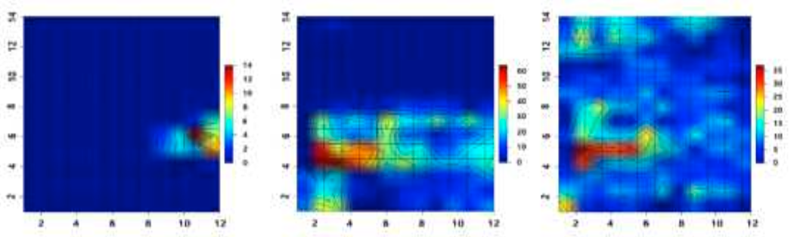
[ Top-View Grid 밀도 분석 ] (LG 이노텍)

[ Side-View Non-Grid 밀도 분석 ]

### 3. Test Sample - 전체 밀도

**3-1. 이미지 관심 영역 설정**

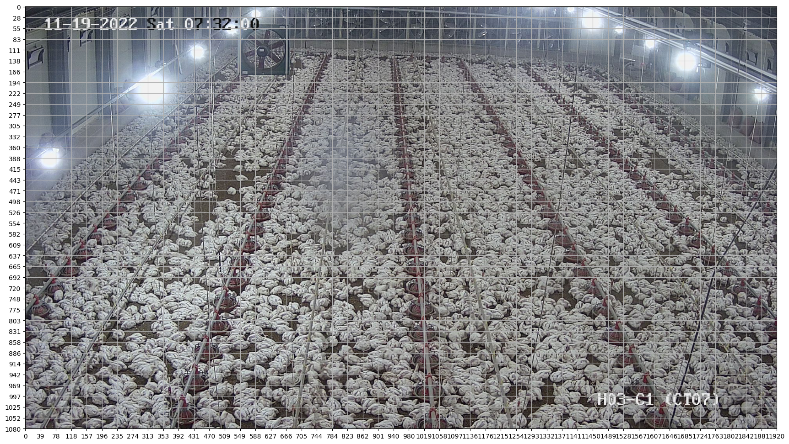

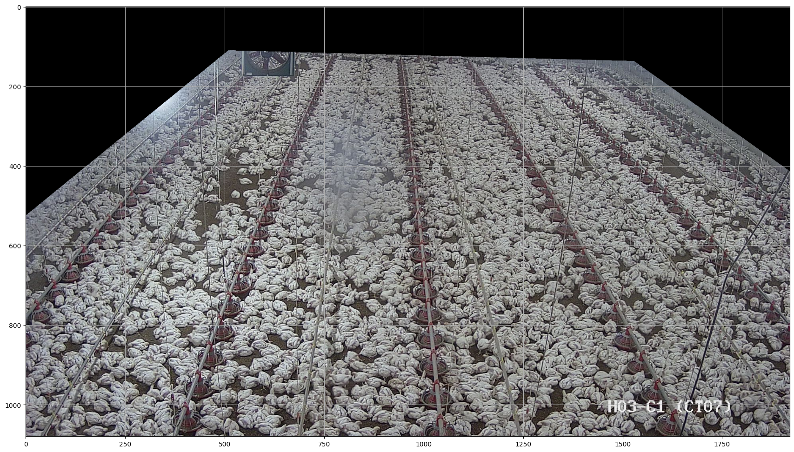

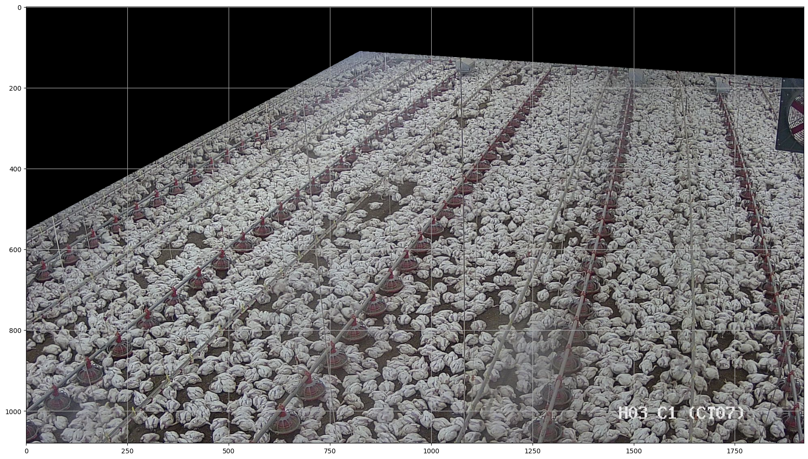

**3-2. 밀도 분석**

첫 번째 시도는 관심 영역 전체에서 닭/면적 비중 확인

  

**Grid 추가**

- 6X4 grid로 동일 크기로 분할
- ratio 계산은 유효 마스크 범위만 추출
- Threshold : 0.4 기준으로 표시..
    
    - 카메라별 threshold 예외 범위 지정 필요 : ex) 카메라 \#1 의 0, 20 index
    - 카메라별 threshold 차등 적용 필요
    - 그리드별 가중치(weight) 별도 추가???
    
    **카메라 \#1**
    
    
    
    
    
    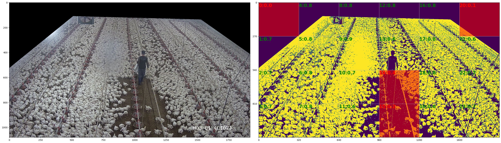
    
    
    
    
    
    +**카메라 \#2**
    
    
    
    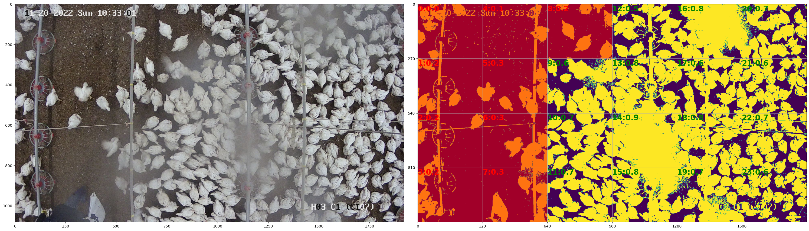
    
    
    
    
    
    
    
    **카메라 \#3**
    
    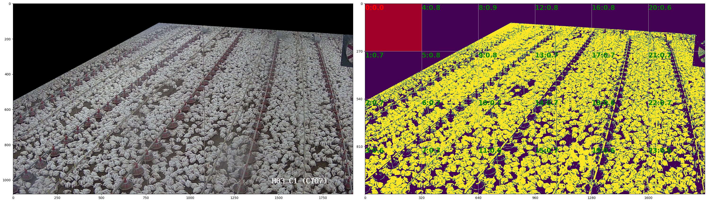
    
    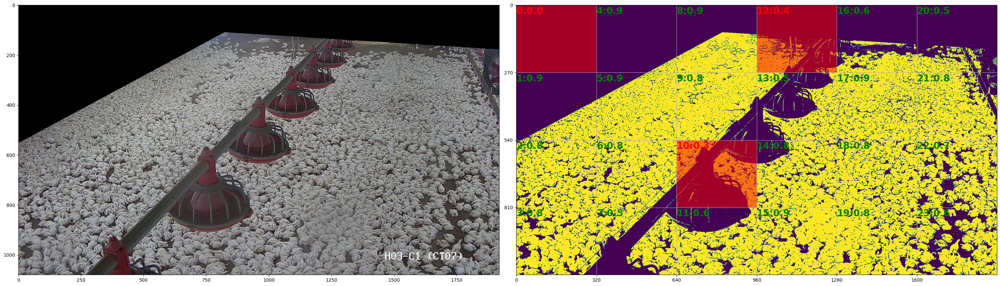
    
      
    

**3-3. A농장 밀도 수치 결과(11/16~21)**

- 일별로 증가 추세
- 이상 부분 확인 가능(출하 등..)

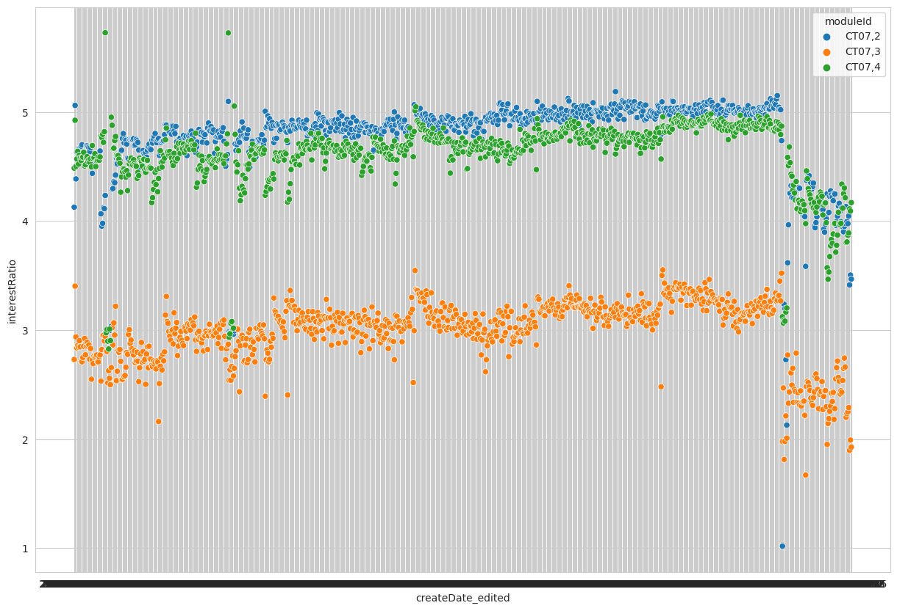

출하 시점

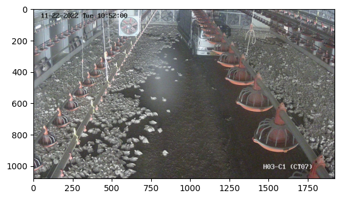

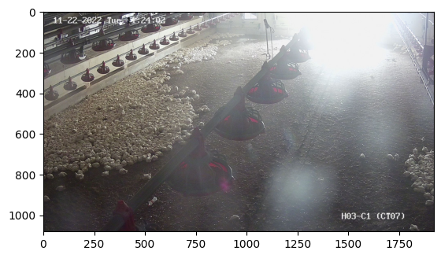

- 이슈 - 야간 ⇒ coloruv ?

 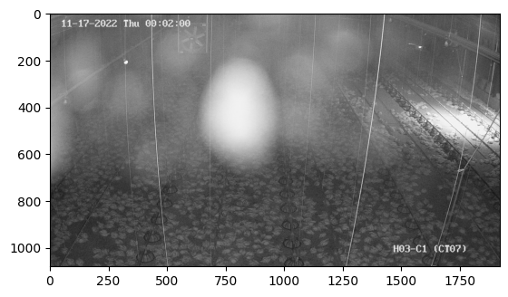   

    
- 이슈 - 카메라와의 거리
    - 가까울수록 밀도 영향력이 크다 ⇒ grid 구분, projection 화 검토(원거리 오차 감소?)
    - 화면 중간에 장애물 존재 시

  
  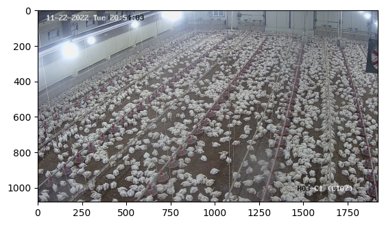
  
<!-- **3-4. B농장 결과(’22/11/23 ~ 12/05)** -->

참조 문서

- [https://scienceon.kisti.re.kr/srch/selectPORSrchReport.do?cn=TRKO202100010091](https://scienceon.kisti.re.kr/srch/selectPORSrchReport.do?cn=TRKO202100010091)
- [https://koreascience.kr/article/JAKO201925454182949.pdf](https://koreascience.kr/article/JAKO201925454182949.pdf)