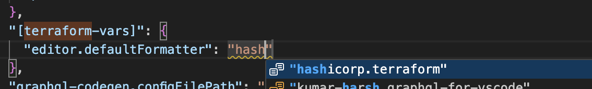

# 02. Terraform Intro

# 1. 환경 설정
## 1-1. 설치 
- aws 활용할 에정이므로 `aws cli` 추가 필요(설치과정 생략) 
- homebrew on macOS 환경으로 설치 
```bash 
$ brew tab hashicorp/tap

$ brew install hashicorp/tap/terraform

$ brew update

$ brew upgrade hashicorp/tap/terraform

$ terraform -help
Usage: terraform [global options] <subcommand> [args]

The available commands for execution are listed below.
The primary workflow commands are given first, followed by
less common or more advanced commands.

...

```
## 1-2. vscode 설정 - extensions
- HashCorp Terraform 설치
- 설정(`⌘+,`) 변경 : formatter for terraform 


# 2. Terraform 기초
## 2-1. HCL 문법 
- 기본 문법 : .tf
- Json 문법 : .tf.json 
> Convention : indent = 2 space 

- arguments(=attribute)
    - 식별자(argument name) = 값(argument value
- blocks : 컨텐츠의 묶음 
- 최상위 block type 
    - resource
    - input
    - output 
    - data 
    - modue
    - ...

## 2-2. resource와 data
- `resource`
    - 가상 네트워크나 인스턴스 같은 객체를 표현 
    - resource type 은 provider 마다 다름
- `data`
    - terraform 외부에서 정의된 정보 
    - local-only data 
        - terraform 내에서만 작동하는 data source 
            - rendering template 
            - reading local files 
            - rendering AWS IAM policies 

## 2-3. first example - `init, plan, apply, destroy` 
```hcl
terraform {
  required_providers {
    aws = {
      source  = "hashicorp/aws"
      version = "~> 5.0"
    }
  }
}

# Configure the AWS Provider
provider "aws" {
  region = "ap-northeast-2" # region 변경
}

# Create a VPC
resource "aws_vpc" "default" { # name 변경
   cidr_block = "10.0.0.0/16"
}
```
### 2-3-1. terraform init 
```bash
❯ terraform init
Initializing the backend...
Initializing provider plugins...
- Finding hashicorp/aws versions matching "~> 5.0"...
- Installing hashicorp/aws v5.82.2...

- Installed hashicorp/aws v5.82.2 (signed by HashiCorp)
Terraform has created a lock file .terraform.lock.hcl to record the provider
selections it made above. Include this file in your version control repository
so that Terraform can guarantee to make the same selections by default when
you run "terraform init" in the future.

Terraform has been successfully initialized!

You may now begin working with Terraform. Try running "terraform plan" to see
any changes that are required for your infrastructure. All Terraform commands
should now work.

If you ever set or change modules or backend configuration for Terraform,
rerun this command to reinitialize your working directory. If you forget, other
commands will detect it and remind you to do so if necessary.
❯ 
❯ 
❯ tree .
.
└── main.tf

1 directory, 1 file
❯ tree . -a
.
├── .terraform # terraform 실행을 위한 library 파일... 최신 버전 5.58.2가 설치됨
│   └── providers
│       └── registry.terraform.io
│           └── hashicorp
│               └── aws
│                   └── 5.82.2
│                       └── darwin_arm64
│                           ├── LICENSE.txt
│                           └── terraform-provider-aws_v5.82.2_x5
├── .terraform.lock.hcl # resource 변경에 대한 lock 파일 생성됨 
└── main.tf

8 directories, 4 files

❯ head .terraform.lock.hcl
# This file is maintained automatically by "terraform init".
# Manual edits may be lost in future updates.

provider "registry.terraform.io/hashicorp/aws" {
  version     = "5.82.2"
  constraints = "~> 5.0"
  hashes = [
    "h1:ce6Dw2y4PpuqAPtnQ0dO270dRTmwEARqnfffrE1VYJ8=",
    "zh:0262fc96012fb7e173e1b7beadd46dfc25b1dc7eaef95b90e936fc454724f1c8",
    "zh:397413613d27f4f54d16efcbf4f0a43c059bd8d827fe34287522ae182a992f9b",
```
- `terraform plan` 
```bash 
❯ terraform plan

Planning failed. Terraform encountered an error while generating this plan.

╷
│ Error: No valid credential sources found
│ 
│   with provider["registry.terraform.io/hashicorp/aws"],
│   on main.tf line 11, in provider "aws":
│   11: provider "aws" {
│ 
│ Please see https://registry.terraform.io/providers/hashicorp/aws
│ for more information about providing credentials.
│ 
│ Error: failed to refresh cached credentials, no EC2 IMDS role found, operation error ec2imds:
│ GetMetadata, exceeded maximum number of attempts, 3, request send failed, Get
│ "http://169.254.169.254/latest/meta-data/iam/security-credentials/": dial tcp
│ 169.254.169.254:80: connect: host is down
│ 
╵
```
### 2-3-2. AWS 인증 추가. IAM user 생성 및 configure
```bash 
❯ aws configure
AWS Access Key ID [None]: AKIA****************TAP
AWS Secret Access Key [None]: E********************ZzWnoJ
Default region name [None]: ap-northeast-2
Default output format [None]: json 

# or aws configure import --csv file;//<filename 활용>
```

### 2-3-3. terraform plan 
```bash
❯ terraform plan

Terraform used the selected providers to generate the following execution plan. Resource actions
are indicated with the following symbols:
  + create

Terraform will perform the following actions:

  # aws_vpc.default will be created
  + resource "aws_vpc" "default" {
      + arn                                  = (known after apply)
      + cidr_block                           = "10.0.0.0/16"
      + default_network_acl_id               = (known after apply)
      + default_route_table_id               = (known after apply)
      + default_security_group_id            = (known after apply)
      + dhcp_options_id                      = (known after apply)
      + enable_dns_hostnames                 = (known after apply)
      + enable_dns_support                   = true
      + enable_network_address_usage_metrics = (known after apply)
      + id                                   = (known after apply)
      + instance_tenancy                     = "default"
      + ipv6_association_id                  = (known after apply)
      + ipv6_cidr_block                      = (known after apply)
      + ipv6_cidr_block_network_border_group = (known after apply)
      + main_route_table_id                  = (known after apply)
      + owner_id                             = (known after apply)
      + tags_all                             = (known after apply)
    }

Plan: 1 to add, 0 to change, 0 to destroy.

──────────────────────────────────────────────────────────────────────────────────────────────────

Note: You didn't use the -out option to save this plan, so Terraform can't guarantee to take
exactly these actions if you run "terraform apply" now.

```
### 2-3-4. terraform apply
- `apply`를 실행하면 실제 적용.
- `apply` 하더라도 `plan`이 먼저 실행 됨 
```bash
❯ terraform apply --auto-approve

Terraform used the selected providers to generate the following execution plan. Resource actions
are indicated with the following symbols:
  + create

Terraform will perform the following actions:

  # aws_vpc.default will be created
  + resource "aws_vpc" "default" {
      + arn                                  = (known after apply)
      + cidr_block                           = "10.0.0.0/16" ### 변경 내용 표시 됨 
      + default_network_acl_id               = (known after apply)
      + default_route_table_id               = (known after apply)
      + default_security_group_id            = (known after apply)
      + dhcp_options_id                      = (known after apply)
      + enable_dns_hostnames                 = (known after apply)
      + enable_dns_support                   = true
      + enable_network_address_usage_metrics = (known after apply)
      + id                                   = (known after apply)
      + instance_tenancy                     = "default"
      + ipv6_association_id                  = (known after apply)
      + ipv6_cidr_block                      = (known after apply)
      + ipv6_cidr_block_network_border_group = (known after apply)
      + main_route_table_id                  = (known after apply)
      + owner_id                             = (known after apply)
      + tags_all                             = (known after apply)
    }

Plan: 1 to add, 0 to change, 0 to destroy.
aws_vpc.default: Creating...
aws_vpc.default: Creation complete after 4s [id=vpc-099c2ba6cbf4b1416]

Apply complete! Resources: 1 added, 0 changed, 0 destroyed.
```

- subnet 추가 
```hcl
resource "aws_subnet" "public_subnet_1" { 
   vpc_id = aws_vpc.default.id
   cidr_block = "10.0.0.0/24"

   tags ={ 
     Name = "han_public_subnet_1"
   }
}

resource "aws_subnet" "public_subnet_2" { 
    vpc_id = aws_vpc.default.id
    cidr_block = "10.0.10.0/24"

   tags ={ 
     Name = "han_private_subnet_1"
   }
}
```

- `terraform apply --auto-aprove`
```bash
❯ terraform apply --auto-approve
aws_vpc.default: Refreshing state... [id=vpc-0aad6405d10e25702]

Terraform used the selected providers to generate the following execution plan. Resource actions
are indicated with the following symbols:
  + create

Terraform will perform the following actions:

  # aws_subnet.public_subnet_1 will be created
  + resource "aws_subnet" "public_subnet_1" {
      + arn                                            = (known after apply)
      + assign_ipv6_address_on_creation                = false
      + availability_zone                              = (known after apply)
      + availability_zone_id                           = (known after apply)
      + cidr_block                                     = "10.0.0.0/24"
      + enable_dns64                                   = false
      + enable_resource_name_dns_a_record_on_launch    = false
      + enable_resource_name_dns_aaaa_record_on_launch = false
      + id                                             = (known after apply)
      + ipv6_cidr_block_association_id                 = (known after apply)
      + ipv6_native                                    = false
      + map_public_ip_on_launch                        = false
      + owner_id                                       = (known after apply)
      + private_dns_hostname_type_on_launch            = (known after apply)
      + tags                                           = {
          + "Name" = "han_public_subnet_1"
        }
      + tags_all                                       = {
          + "Name" = "han_public_subnet_1"
        }
      + vpc_id                                         = "vpc-0aad6405d10e25702"
    }

  # aws_subnet.public_subnet_2 will be created
  + resource "aws_subnet" "public_subnet_2" {
      + arn                                            = (known after apply)
      + assign_ipv6_address_on_creation                = false
      + availability_zone                              = (known after apply)
      + availability_zone_id                           = (known after apply)
      + cidr_block                                     = "10.0.10.0/24"
      + enable_dns64                                   = false
      + enable_resource_name_dns_a_record_on_launch    = false
      + enable_resource_name_dns_aaaa_record_on_launch = false
      + id                                             = (known after apply)
      + ipv6_cidr_block_association_id                 = (known after apply)
      + ipv6_native                                    = false
      + map_public_ip_on_launch                        = false
      + owner_id                                       = (known after apply)
      + private_dns_hostname_type_on_launch            = (known after apply)
      + tags                                           = {
          + "Name" = "han_private_subnet_1"
        }
      + tags_all                                       = {
          + "Name" = "han_private_subnet_1"
        }
      + vpc_id                                         = "vpc-0aad6405d10e25702"
    }

Plan: 2 to add, 0 to change, 0 to destroy.
aws_subnet.public_subnet_1: Creating...
aws_subnet.public_subnet_2: Creating...
aws_subnet.public_subnet_1: Creation complete after 1s [id=subnet-03d0b81020b3a291f]
aws_subnet.public_subnet_2: Creation complete after 1s [id=subnet-0db865023af498bb0]

Apply complete! Resources: 2 added, 0 changed, 0 destroyed.
 
```
### 2-3-5. `data` block 
- AWS console 에서 생성 후 terraform 에서 반영하기 위해서는
    - data block을 활용하여 동기화 
```hcl
data "aws_subnet" "private_subnet1" {
    id = "subnet-1231293810923" ## 
}
```

### 2-3-6. 삭제는 `terraform destroy` 로 전체 리소스 삭제 

## 2-4. module
- 함께 사용하는 여러개의 리소스에 대한 컨테이너 
- 디렉토리 안에 여러개의 .tf/.tf.json 파일로 구성됨 
- 리소스 설정을 패키징 하거나 재사용하기 위한 주요 방법 중 하나 
- 모든 terraform 설정은 적어도 하나의 module 로 구성된다. 
    - 최상위는 `root module` 
    - `child module` : `root module` 내 다른 module 
- public/private registry를 통해서 선언한 module을 publish or load 할 수 있다. 

#### source 
- 필수 argument 
- 설정 파일이 포함된 local directory path 또는 download 가능한 remote module 
- modle block 이 추가/수정/삭제 되먄 **`terraform init`** 을 실행 해야 함

#### version 
- 설치하고자 하는 module version 
- registry를 통해서 배포하고자 할 때 유용한 정보 

### 2-4-1. module 화 
#### 하위 디렉터리(`han_vpc`) 생성 후 기존 `./main.tf` 의 `resource` 생성 구문을 모두 `./han_vpc/main.tf`로 이동 
```bash 
❯ tree .
.
├── han_vpc
│   └── main.tf
├── main.tf
├── terraform.tfstate
├── terraform.tfstate.backup
```
#### `./main.tf`에 module 정보 추가 
```hcl 

module "default_han_vpc" {
  source = "./hans_vpc"
}

```

#### `terraform init` 실행 
>  주의! : `terraform init` 없이 `terraform plan` 실행 시 error 발생
> ```bash
> ❯ terraform plan
> ╷
> │ Error: Module not installed
> │ 
> │   on main.tf line 15:
> │   15: module "default_han_vpc" {
> │ 
> │ This module's local cache directory han_vpc could not be read. Run "terraform init" to install
> │ all modules required by this configuration.
> ```

### 2-4-2. 기존 resource 재활용
- 기존 resource의 위치가 변화 하므로 plan 시 삭제 및 재생성이 발생한다. 
- 기존 resource를 그대로 활용하기 위해서는 `terraform import`+\<resource id\> 나 `terraform move`를 활용해 작업 시간을 단축 시킬 수 있다.
- ~~자원이 많지 않고 귀찮으니 재생성 하는 걸로..~~